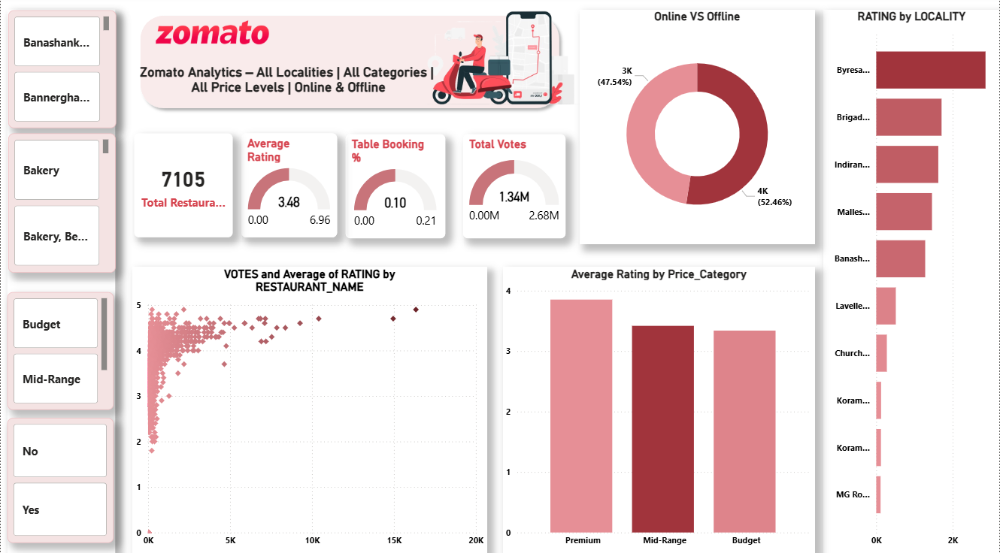

# Zomato Data Analysis (2019–2025)
## Dashboard Preview



## Project Overview

This project analyzes restaurant performance data inspired by the Zomato platform.
The dataset covers restaurant operations in **Pune from 2019 to 2025**, enabling analysis of sales trends, cuisine popularity, and delivery performance.

The goal of this project is to demonstrate an **end-to-end data analytics workflow using Excel, Oracle SQL, and Power BI.**

---

## Tools & Technologies

* **Excel** – Data cleaning and preparation
* **Oracle SQL** – Database creation and analytical queries
* **Power BI** – Data visualization and dashboard creation

---

## Dataset Description

The dataset simulates real restaurant operations and includes:

* Restaurant name and location
* Cuisine categories
* Order volume and sales revenue
* Delivery status
* Ratings and votes
* Price range and restaurant type
* Year-wise data from **2019 to 2025**

---

## Key Business Questions

This analysis answers questions such as:

* How have restaurant sales changed from **2019 to 2025**?
* Which **cuisines generate the highest revenue**?
* What is the **delivery success rate**?
* Which restaurants generate the **highest sales**?
* How does **price range affect restaurant performance**?

---

## SQL Analysis Performed

Some key SQL queries include:

* Year-wise sales trend analysis
* Top restaurants by sales
* Delivery success rate calculation
* Cuisine-wise revenue analysis
* Price range distribution

---

## Power BI Dashboard

The dashboard includes:

**Executive Summary**

* Total Sales
* Total Orders
* Average Rating
* Delivery Success %

**Restaurant Analysis**

* Top restaurants by revenue
* Cuisine performance

**Delivery Performance**

* Delivery status distribution
* Locality-based performance

---

## Project Structure

```
zomato-data-analysis
│
├── zomato_dataset.csv
├── zomato_analysis.sql
├── zomato_dashboard.pbix
└── README.md
```

---

## Project Outcome

This project demonstrates how restaurant business data can be analyzed to generate insights on **sales growth, customer preferences, and operational efficiency.**

The workflow replicates a real-world data analytics pipeline used by businesses for decision-making.

